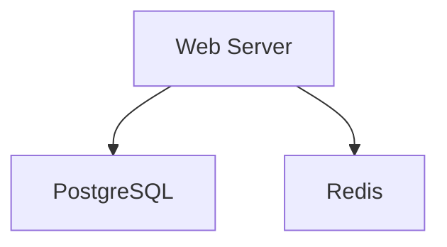
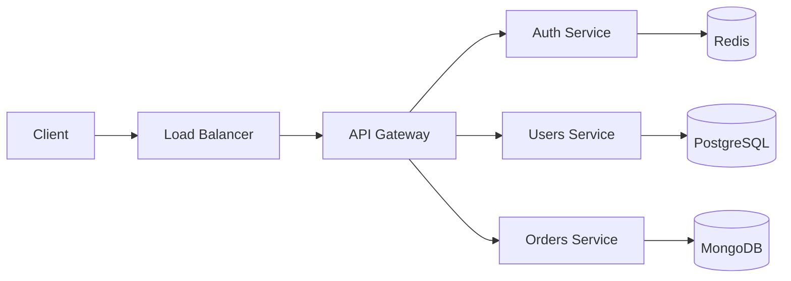
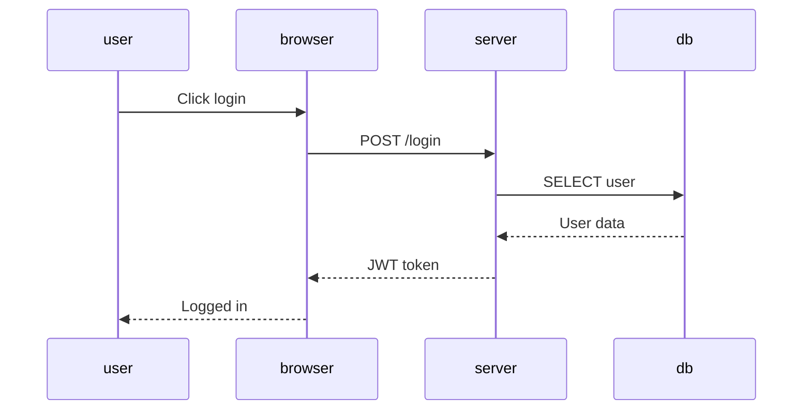
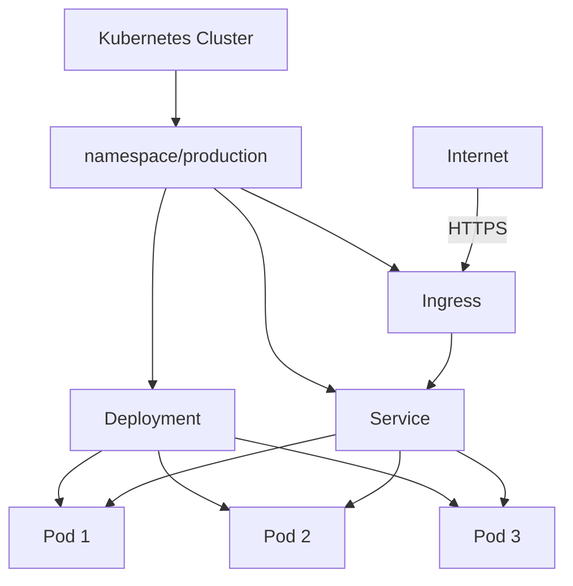
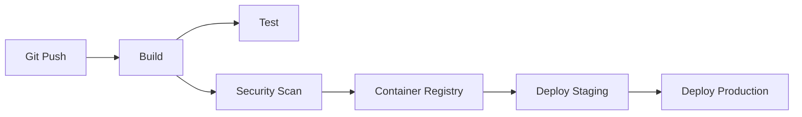

This post demonstrates how to use Mermaid diagrams in your blog posts.

## Basic Shapes



## Architecture Diagram



## Sequence Diagram



## Kubernetes Deployment



## CI/CD Pipeline



---

## How to Use Mermaid

Mermaid is already supported in Astro. Simply use fenced code blocks with the `mermaid` language:

````markdown
```mermaid
server -> database
```
````

The diagrams are rendered at build time and output as SVGs.

### Resources

- [Mermaid Documentation](https://mermaid.js.org)
- [Mermaid Playground](https://mermaid.live)
