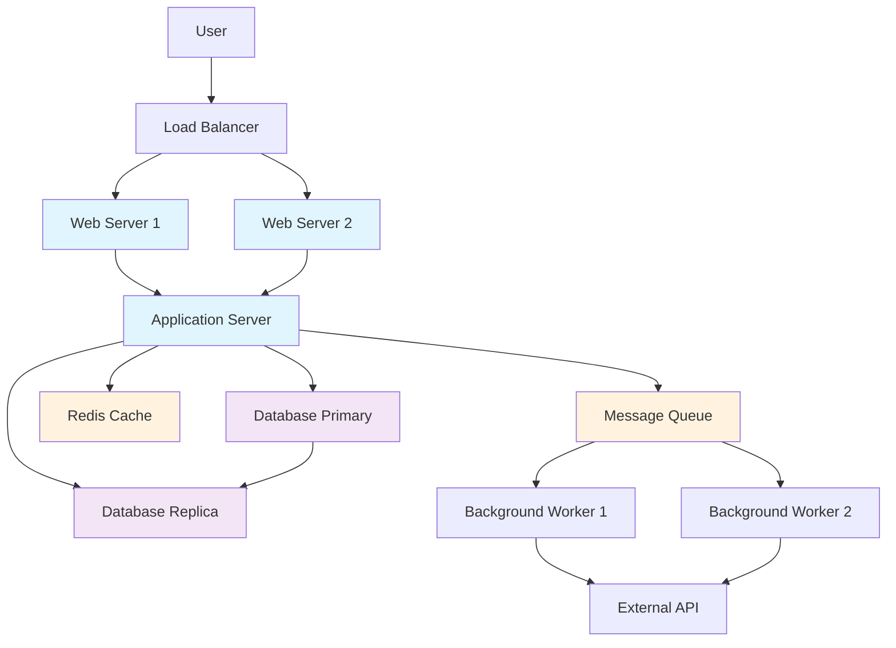

## But why the complexity?

[Mermaid](https://mermaid.js.org/) is a javascript based diagramming tool that allows you to embed diagrams inside your markdown content, its syntax is simple, but I am not entirely satisfied with it.

This library is useful for these kind of contents:

- Great range of different diagrams.
- Easy to use.
- Lots of available integrations.
- Easy to integrate within astro or any other web framework.

However, when building large diagrams the syntax becomes hard to follow, especially if it is embedded inside markdown documents and since most of the diagrams are going to be in my website, I want to be able to share them more easily.

Enter the **[D2](https://d2lang.com/)** language.

## D2

D2 is a language built on top of golang designed specifically to build diagrams. Okay, now it sounds exactly the same as Mermaid, right? Kind of. However, it has some interesting features that made me switch over it.

Mermaid is to based on javascript, so it means the users will have to download more libraries when accesing my website. However, integrating a whole programming language just to build diagrams sounds like too much.
Why? Installing mermaid is as simple as just including it in your dependencies and possibly it might be needed to build a middleware between markdown and mermaid as a component to render the diagrams.

The integration of D2 was a bit more complex than that.

D2 can be stored in ```*.d2``` file extension, whereas mermaid can be integrated as a code block or as a custom component. To deliver the D2 diagrams, I had two options in mind:

- Build them locally and push them to the main branch.
- Build them through the Docker Image dynamically to ensure they are always up to date.

I went for the second option to avoid duplicated content in my repository. Running it during build time sounds more more fun and scalable than having to recreate it every single time.

If we take a look at the Dockerfile:
<Details summary="Dockerfile">

```Dockerfile
# Base stage for shared settings
FROM node:23.9.0-alpine AS base
ENV NEXT_TELEMETRY_DISABLED=1

# Install dependencies only when needed

FROM base AS deps
WORKDIR /app
RUN apk add --no-cache libc6-compat curl bash make
COPY package.json yarn.lock .yarnrc.yml ./

# Install dependencies

RUN yarn install --frozen-lockfile

# Builder stage

FROM base AS builder
WORKDIR /app

RUN apk add --no-cache curl bash make

COPY --from=deps /app/node_modules ./node_modules
COPY --from=deps /app/.yarnrc.yml ./

RUN  curl -fsSL <https://d2lang.com/install.sh> -o /tmp/d2install.sh \
    && sh /tmp/d2install.sh \
    && rm /tmp/d2install.sh

COPY data/diagrams ./data/diagrams
RUN mkdir -p public/static/diagrams \
    && for f in data/diagrams/*.d2; do \
    name=$(basename "${f%.d2}"); \
    d2 --theme 0 --dark-theme 200 "$f" "public/static/diagrams/${name}.svg"; \
    done

COPY . .
RUN yarn optimize_svgs
RUN yarn build

FROM node:23.9.0-alpine AS runner
WORKDIR /app

ENV NODE_ENV=production
ENV NEXT_TELEMETRY_DISABLED=1
ENV PORT=3000
ENV HOSTNAME="0.0.0.0"

RUN addgroup --system --gid 1001 nodejs && \
    adduser --system --uid 1001 nextjs && \
    chown -R nextjs:nodejs /app

# Copy only necessary files

COPY --from=builder --chown=nextjs:nodejs /app/public ./public
COPY --from=builder --chown=nextjs:nodejs /app/.next/standalone ./
COPY --from=builder --chown=nextjs:nodejs /app/.next/static ./.next/static

# Use non-root user

USER nextjs

# Expose port

EXPOSE 3000

# Start the application

CMD ["node", "server.js"]

```

</Details>

In the builder stage, the D2 integration happens. The installation is done through the official installation script and later with some bash each diagram gets generated and outputed to the public folder.

I found the  [svgo](https://github.com/svg/svgo) tool quite useful to optimise the size of the generated svgs.

```Dockerfile
RUN  curl -fsSL https://d2lang.com/install.sh -o /tmp/d2install.sh \
    && sh /tmp/d2install.sh \
    && rm /tmp/d2install.sh

COPY data/diagrams ./data/diagrams
RUN mkdir -p public/static/diagrams \
    && for f in data/diagrams/*.d2; do \
    name=$(basename "${f%.d2}"); \
    d2 --theme 0 --dark-theme 200 "$f" "public/static/diagrams/${name}.svg"; \
    done

COPY . .
RUN yarn optimize_svgs
```

## Comparing D2 with mermaid

Why D2 is Better

1. Cleaner Hierarchical Structure
D2 uses natural nesting with {} brackets, making complex relationships easier to read than Mermaid's node-and-edge syntax.
2. More Intuitive Styling
D2 allows CSS-like styling directly on elements, while Mermaid requires separate class definitions and assignments.
3. Better for Large Diagrams
The hierarchical syntax scales better - you can group related elements naturally instead of having long lists of connections.
4. Flexible Shapes and Layouts
D2 has built-in support for specialized shapes (like SQL tables) and better automatic layout algorithms.
5. Easier Maintenance
When you need to modify a complex diagram, D2's structure makes it clearer where to make changes.

Mermaid:



D2:

```d2
vars: {
  d2-config: {
    layout-engine: dagre
  }
}

User -> LoadBalancer
LoadBalancer -> WebServer1
LoadBalancer -> WebServer2

WebServer1 -> ApplicationServer
WebServer2 -> ApplicationServer

ApplicationServer -> DatabasePrimary
ApplicationServer -> RedisCache
ApplicationServer -> MessageQueue

DatabasePrimary -> DatabaseReplica

MessageQueue -> BackgroundWorker1
MessageQueue -> BackgroundWorker2

BackgroundWorker1 -> ExternalAPI
BackgroundWorker2 -> ExternalAPI

# Assign classes
ApplicationServer.class: server
WebServer1.class: server
WebServer2.class: server
DatabasePrimary.class: database
DatabaseReplica.class: database
RedisCache.class: cache
MessageQueue.class: cache

# Labels (so names look nice in the diagram)
LoadBalancer.label: "Load Balancer"
WebServer1.label: "Web Server 1"
WebServer2.label: "Web Server 2"
ApplicationServer.label: "Application Server"
DatabasePrimary.label: "Database Primary"
DatabaseReplica.label: "Database Replica"
RedisCache.label: "Redis Cache"
MessageQueue.label: "Message Queue"
BackgroundWorker1.label: "Background Worker 1"
BackgroundWorker2.label: "Background Worker 2"
ExternalAPI.label: "External API"

```
