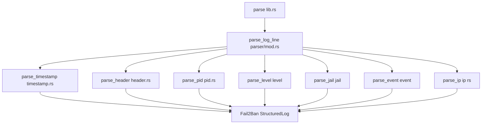

import SeriesBanner from "../../components/SeriesBanner.astro";
import Callout from "../../components/mdx/Callout.astro";
import Badge from "../../components/mdx/Badge.astro";
import Steps from "../../components/mdx/Steps.astro";

<SeriesBanner
  series="Building a Multi-Language Parser"
  part={1}
  posts={[
    {
      title: "Understanding the Fail2Ban Log Parser",
      slug: "fail2ban-log-parser-intro",
      part: 1,
    },
  ]}
/>

If you've ever managed a Linux server, chances are you've encountered Fail2Ban. It's one of those essential tools that quietly protects your server from brute-force attacks, banning IPs that repeatedly fail to authenticate. But here's the thing: while Fail2Ban does its job beautifully, reading its logs is... painful.

Raw Fail2Ban log lines look something like this:

```
2024-01-01 12:00:00,123 fail2ban.filter [1] INFO [sshd] Found 1.2.3.4
2024-01-01 12:00:01,456 fail2ban.actions [1] NOTICE [sshd] Ban 1.2.3.4
2024-01-01 12:00:15,789 fail2ban.actions [1] INFO [sshd] Ban 5.6.7.8
```

It's _parsable_ by a human, sure. But if you want to answer questions like "Which jail has the most bans this week?" or "What's the ban-to-unban ratio for the nginx-http-auth jail?" Now get ready to play with lots of string splitting and regex matching pain.

That's exactly where this project comes in.

<Callout type="tip" title="What we're building">
  A simple to use Rust library with bindings to python, Typescript and
  WebAssembly to transform unorganised text into structured and easy-to-use data
  structures.
</Callout>

## Why Build a Parser?

The most straightforward answer? I was curious about building a parser and bindings to other languages, and Fail2Ban logs were the perfect excuse.

Parsing is one of those fundamental skills that comes up everywhere: configuration files, network protocols, data exchange formats... And once you've got a solid core in Rust, the natural next question is: "How do I use this from Python? TypeScript? WebAssembly"

That's what this series is really about. Fail2Ban logs are just the excuse. The real goal is exploring how to take a Rust library and make it accessible across the programming landscape.

## Why Rust?

You might wonder, why build this in Rust?

Parsing is exactly what Rust is good at. The type system catches bugs at compile time, there's no runtime overhead, and the winnow library is very well-designed.

But more importantly, Rust gives us a solid foundation for _other_ languages. In upcoming parts of this series, we'll see how to generate bindings for Python, TypeScript and WebAssembly from the same core.

## What Makes It Tick

The fail2ban-log-parser-core crate is a Rust library, it transforms raw log lines into a clean struct that gives you easy access to every piece of information:

- [GitHub](https://github.com/adrianvillanueva997/fail2ban-log-parser)
- [crates.io](https://crates.io/crates/fail2ban-log-parser-core)
- [pypi.org](https://pypi.org/project/fail2ban-log-parser/)
- NPM coming soon!

```rust
pub struct Fail2BanStructuredLog<'a> {
    pub timestamp: Option<DateTime<Utc>>,
    pub header: Option<Fail2BanHeaderType>,
    pub pid: Option<u32>,
    pub level: Option<Fail2BanLevel>,
    pub jail: Option<&'a str>,
    pub event: Option<Fail2BanEvent>,
    pub ip: Option<IpAddr>,
}
```

<Callout type="note" title="Design Choice">
  Each field can be optional because Fail2Ban log formats aren't perfectly
  consistent across versions and configurations. This design gracefully handles
  missing fields, it does not fail when a log line is slightly different than
  expected.
</Callout>

## Architecture

Here's how the pieces fit together:



## Under the Hood

<Steps title="From Raw Text to Structured Data">

<div>

### 1. The Entry Point

The public API is refreshingly simple:

```rust
pub fn parse(input: &str) -> impl Iterator<Item = Result<Fail2BanStructuredLog<'_>, ParseError>> {
    input.lines().enumerate().map(|(i, line)| {
        parser::parse_log_line(&mut &*line).map_err(|_| ParseError {
            line_number: i + 1,
            line: line.to_string(),
        })
    })
}
```

You pass in a string (entire log file, multiple lines, whatever you have), and you get back an iterator. Each item is a `Result`—either a successfully parsed log entry, or a parse error with the line number and content for debugging.

The iterator approach is nice because it's memory-efficient. For huge log files, you don't need to load everything into memory at once.

</div>

<div>

### 2. Going Parallel

If you're processing a massive log file and have the `parallel` feature enabled, things get interesting. The parser switches to using Rayon:

```rust
#[cfg(feature = "parallel")]
pub fn parse(input: &str) -> impl Iterator<Item = Result<Fail2BanStructuredLog<'_>, ParseError>> {
    let lines: Vec<&str> = input.lines().collect();
    lines.par_iter()...
}
```

Same API, different implementation under the hood. Same code, twice the throughput on multi-core machines. Not bad for a feature flag. If you are curious about benchmarks, I am keeping track of the library performance [here](https://adrianvillanueva997.github.io/fail2ban-log-parser/).

</div>

<div>

### 3. The Parsing Pipeline

This is where it gets fun. Each log line goes through a sequence of parsers, one after another:

```rust
pub(crate) fn parse_log_line<'a>(input: &mut &'a str) -> winnow::Result<Fail2BanStructuredLog<'a>> {
    let timestamp = parse_timestamp.parse_next(input)?;
    multispace1.parse_next(input)?;
    let header = parse_header.parse_next(input)?;
    // ... and so on
}
```

We're using [winnow](https://github.com/winnow-rs/winnow), a fantastic parsing combinator library for Rust. Instead of writing one massive regex or state machine, you compose small parsing functions together.

</div>

<div>

### 4. Individual Parsers

Each component has its own dedicated parser living in its own file:

| Parser            | File           | What It Extracts                                                        |
| ----------------- | -------------- | ----------------------------------------------------------------------- |
| `parse_timestamp` | `timestamp.rs` | `DateTime<Utc>`: handles formats like `2024-01-01 12:00:00,123`         |
| `parse_header`    | `header.rs`    | `Fail2BanHeaderType`: things like `fail2ban.filter`, `fail2ban.actions` |
| `parse_pid`       | `pid.rs`       | `u32`: the process ID in brackets                                       |
| `parse_level`     | `level.rs`     | `Fail2BanLevel`: DEBUG, INFO, WARNING, NOTICE, ERROR                    |
| `parse_jail`      | `jail.rs`      | `&str`: the jail name like `sshd`, `nginx-http-auth`                    |
| `parse_event`     | `event.rs`     | `Fail2BanEvent`: what actually happened                                 |
| `parse_ip`        | `ip.rs`        | `IpAddr`: IPv4 or IPv6                                                  |

This modularity is intentional. Each parser is small, focused, and independently testable.

</div>

<div>

### 5. What Actually Happened

The `Fail2BanEvent` enum captures the type of event in each log line:

- **Found**: An IP was detected matching a jail's filter (the first step before a ban)
- **Ban**: The IP was actually banned
- **Unban**: The IP was released from the ban list
- **Restore**: A previous ban was restored (Fail2Ban keeps track of these)
- **Ignore**: An IP was explicitly ignored (whitelisted)
- **AlreadyBanned**: Fail2Ban tried to ban an IP that was already banned
- **Failed**: Something went wrong
- **Unknown**: The parser couldn't figure out what happened

</div>

</Steps>

<Callout type="tip" title="Query-friendly">
  With structured data, questions that would require complex regex now become
  simple filter operations. Ban events only? Just `filter(entry.event ==
  Some(Ban))`.
</Callout>

## A Real Example

**Input:**

```
2024-01-01 12:00:00,123 fail2ban.filter [1] INFO [sshd] Found 1.2.3.4
2024-01-01 12:00:01,456 fail2ban.actions [1] NOTICE [sshd] Ban 1.2.3.4
2024-01-01 12:00:15,789 fail2ban.actions [1] INFO [sshd] Ban 5.6.7.8
```

**Parsed output:**

```rust
// Entry 1
Fail2BanStructuredLog {
    timestamp: Some(2024-01-01T12:00:00.123Z),
    header: Some(Fail2BanHeaderType::Filter),
    pid: Some(1),
    level: Some(Info),
    jail: Some("sshd"),
    event: Some(Found),
    ip: Some(1.2.3.4)
}

// Entry 2
Fail2BanStructuredLog {
    timestamp: Some(2024-01-01T12:00:01.456Z),
    header: Some(Fail2BanHeaderType::Actions),
    pid: Some(1),
    level: Some(Notice),
    jail: Some("sshd"),
    event: Some(Ban),
    ip: Some(1.2.3.4)
}

// Entry 3
Fail2BanStructuredLog {
    timestamp: Some(2024-01-01T12:00:15.789Z),
    header: Some(Fail2BanHeaderType::Actions),
    pid: Some(1),
    level: Some(Info),
    jail: Some("sshd"),
    event: Some(Ban),
    ip: Some(5.6.7.8)
}
```

Now you can easily answer questions like "Which IPs were banned on January 1st?" or "How many times did sshd trigger a Found event?"

## Putting It to Work

Using the library is straightforward:

```rust
use fail2ban_log_parser_core::parse;

let log_data = r#"
2024-01-01 12:00:00,123 fail2ban.filter [1] INFO [sshd] Found 1.2.3.4
2024-01-01 12:00:01,456 fail2ban.actions [1] NOTICE [sshd] Ban 1.2.3.4
2024-01-01 12:00:15,789 fail2ban.actions [1] INFO [nginx] Ban 10.0.0.1
"#;

for result in parse(log_data) {
    match result {
        Ok(entry) => {
            println!("At {}: {} in jail '{}'",
                entry.timestamp().map(|t| t.to_rfc3339()).unwrap_or_default(),
                format!("{:?}", entry.event()),
                entry.jail().unwrap_or("unknown"));
        }
        Err(e) => {
            eprintln!("Failed to parse line {}: {}", e.line_number, e.line);
        }
    }
}
```

This would output something like:

```
At 2024-01-01T12:00:00.123Z: Some(Found) in jail 'sshd'
At 2024-01-01T12:00:01.456Z: Some(Ban) in jail 'sshd'
At 2024-01-01T12:00:15.789Z: Some(Ban) in jail 'nginx'
```

## The Tech Stack

<div
  style={{ display: "flex", gap: "0.5rem", flexWrap: "wrap", margin: "1rem 0" }}
>
  <Badge type="info">winnow</Badge>
  <Badge type="info">chrono</Badge>
  <Badge type="info">Rayon</Badge>
  <Badge type="info">serde</Badge>
</div>

This parser wouldn't exist without some fantastic open-source libraries:

- **[winnow](https://github.com/winnow-rs/winnow)** The parsing combinator library. It's like regex, but composable and typed.
- **[chrono](https://github.com/chronotope/chrono)** The gold standard for date/time in Rust.
- **[Rayon](https://github.com/rayon-rs/rayon)** Gives us parallel processing with almost zero code changes.
- **[serde](https://github.com/serde-rs/serde)** Optional serialization to JSON.

<Callout type="warning" title="Coming soon">
  This is just the beginning. In **Part 2**, we will explore Python bindings
  with PyO3. By the end of this series, you will be able to parse Fail2Ban logs
  from Python, TypeScript and even in the browser with WebAssembly, all from the
  same Rust codebase!
</Callout>

_Ready to dive deeper? Stay tuned for Part 2 where we'll explore Python bindings!_
